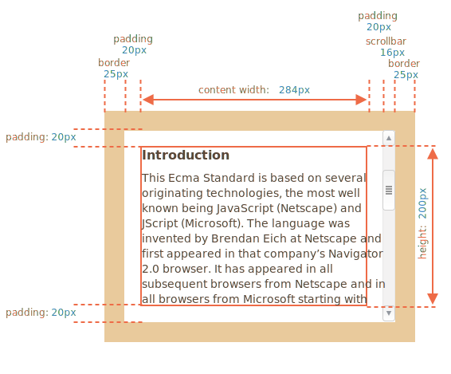
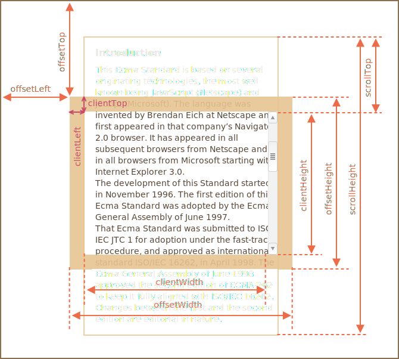
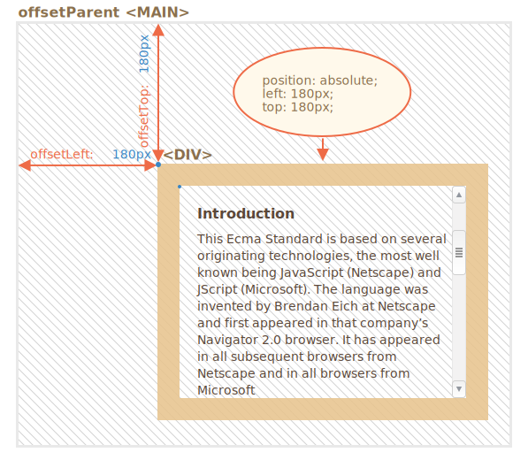
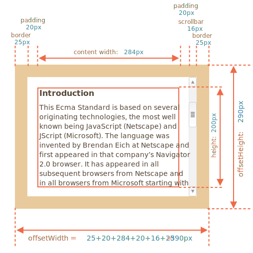
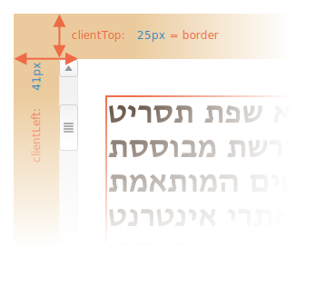
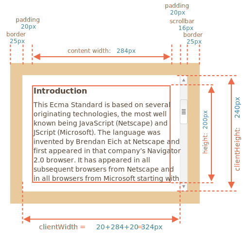
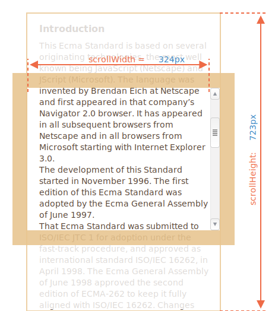
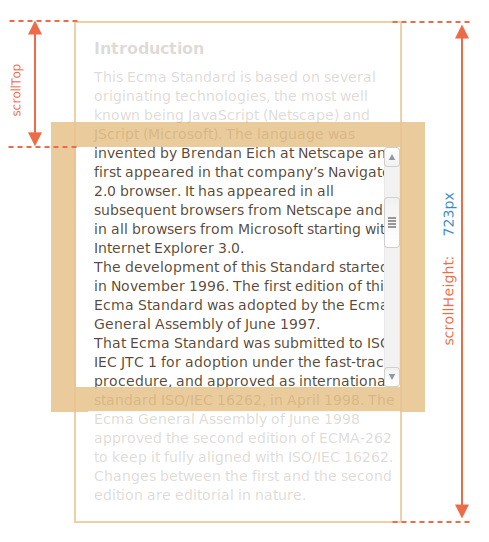

# 元素大小和滚动
## 示例元素
```css
<div id="example">
  ...Text...
</div>
<style>
  #example {
    width: 300px;
    height: 200px;
    border: 25px solid #E8C48F;
    padding: 20px;
    overflow: auto;
  }
</style>
```
[沙箱查看](https://codepen.io/yung-twist/pen/MWjLmdE)  
  
::: danger 注意滚动条
上图演示了元素具有滚动条这种最复杂的情况。一些浏览器（并非全部）通过从内容（上面标记为 “content width”）中获取空间来为滚动条保留空间。  

因此，如果没有滚动条，内容宽度将是 300 px，但是如果滚动条宽度是 16px（不同的设备和浏览器，滚动条的宽度可能有所不同），那么还剩下 300 - 16 ＝ 284px。
:::

## 几何
这是带有几何属性的整体图片：
  

## offsetLeft/Top

属性 offsetLeft/offsetTop 提供元素相对于 offsetParent 左上角的 x/y 坐标。
> offsetParent 是离元素最接近的祖先元素，(CSS 定位的 position 为 absolute，relative 或 fixed)。

在下面这个例子中,内部的 \<div> 有 \<main> 作为 offsetParent,并且 offsetLeft/offsetTop 让它从左上角位移(180)
```html
<main style="position: relative" id="main">
  <article>
    <div id="example" style="position: absolute; left: 180px; top: 180px">...</div>
  </article>
</main>
<script>
  alert(example.offsetParent.id); // main
  alert(example.offsetLeft); // 180（注意：这是一个数字，不是字符串 "180px"）
  alert(example.offsetTop); // 180
</script>
```
  
有以下几种情况下，offsetParent 的值为 null：  

- 对于未显示的元素（display:none 或者不在文档中）。
- 对于 \<body> 与 \<html>。
- 对于带有 position:fixed 的元素。

## offsetWidth/Height
offsetWidth/Height 提供了元素的“外部” width/height（包括边框）。  
  
对于我们的示例元素：  

- offsetWidth = 390 — 外部宽度（width），可以计算为内部 CSS-width（300px）加上 padding（2 * 20px）和 border（2 * 25px）。
- offsetHeight = 290 — 外部高度（height）。

> 对于未显示的元素，几何属性为 0/null。

## clientTop/Left

在我们的例子中：   

- clientLeft = 25 — 左边框宽度
- clientTop = 25 — 上边框宽度

当文档中有滚动条时
  
在这种情况下，clientLeft 的值将不是 25，而是加上滚动条的宽度 25 + 16 = 41。

## clientWidth/Height

这些属性提供了元素边框内区域的大小。  
它们包括了 “content width” 和 “padding”，但不包括滚动条宽度（scrollbar）：  
   

## scrollWidth/Height
这些属性就像 clientWidth/clientHeight，但它们还包括滚动出（隐藏）的部分：  
   
在上图中：  

- scrollHeight = 723 — 是内容区域的完整内部高度，包括滚动出的部分。
- scrollWidth = 324 — 是完整的内部宽度，这里我们没有水平滚动，因此它等于 clientWidth。

## scrollLeft/scrollTop
属性 scrollLeft/scrollTop 是元素的隐藏、滚动部分的 width/height。  

在下图中，我们可以看到带有垂直滚动块的 scrollHeight 和 scrollTop。  
   

## 总结  
元素具有以下几何属性：  

- offsetParent — 是最接近的 CSS 定位的祖先，或者是 td，th，table，body。
- offsetLeft/offsetTop — 是相对于 offsetParent 的左上角边缘的坐标。
- offsetWidth/offsetHeight — 元素的“外部” width/height，边框（border）尺寸计算在内。
- clientLeft/clientTop — 从元素左上角外角到左上角内角的距离。对于从左到右显示内容的操作系统来说，它们始终是左侧/顶部 border 的宽度。而对于从右到左显示内容的操作系统来说，垂直滚动条在左边，所以 clientLeft 也包括滚动条的宽度。
- clientWidth/clientHeight — 内容的 width/height，包括 padding，但不包括滚动条（scrollbar）。
- scrollWidth/scrollHeight — 内容的 width/height，就像 clientWidth/clientHeight 一样，但还包括元素的滚动出的不可见的部分。
- scrollLeft/scrollTop — 从元素的左上角开始，滚动出元素的上半部分的 width/height。