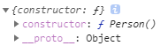
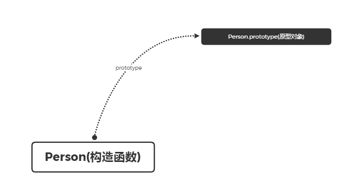
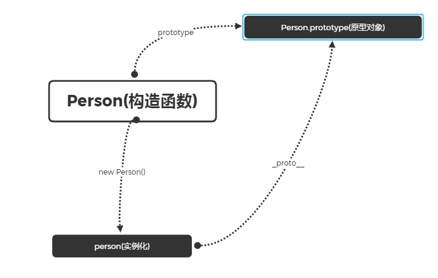
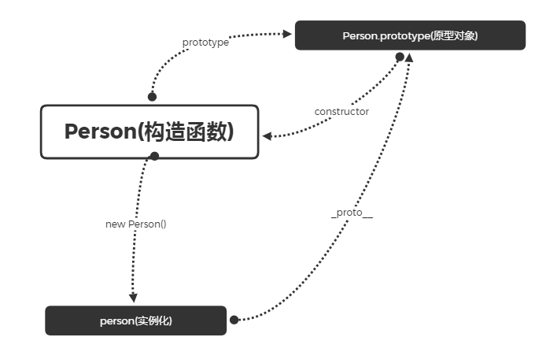
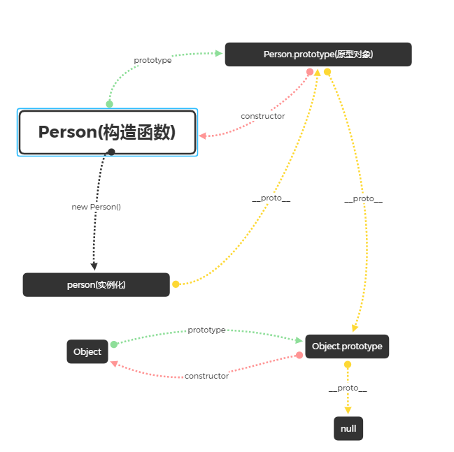

## 原型对象
我们使用 ***function*** 创建函数的时候，内存中会创建一个包含prototype属性的对象，这个属性指向函数的原型对象，如下所示：
```js
function Person() {
    
}
Person.prototype // {constructor: Person(), __proto__}
```
上述代码中我们创建了一个名为 ***Person*** 的函数：  
- ***prototype*** 属性指向的就是 ***Person*** 的原型对象
- 原型对象里包含 ***constructor*** 与 ***__proto__*** 属性  
> 其中 ***constructor*** 指向构造函数 ***Person***     
> ***\_\_proto\_\_*** 指向 Object  


- 每个对象都会从原型“继承”属性
```js
console.log(Person.prototype.constructor === Person) // true
console.log(Person.prototype.__proto__ === Object.prototype) // true
```


## 实例化
当我们实例化一个构造函数时，也会为这个实例创建一个 ***\_\_proto\_\_*** 属性，这个属性是一个指针，它指向构造函数的原型对象，同样构造函数的原型也有一个 ***\_\_proto\_\_*** 属性指向生成该构造函数实例的原型 ***prototype***， 以此类推，直到找到 ***Object*** 停止，***Object*** 是原型链的最顶级，他的 ***\_\_proto\_\_*** 为null
```js
// 实例化对象
const person = new Persion();
console.log(person.__proto__ === Person.prototype) // true
```


## 原型对象与构造函数的关系
每个原型对象都有一个 ***constructor*** 属性，它指向该对象的构造函数。
```js
console.log(Person.prototype.constructor === Person) // true
```


## 实例属性的读取顺序
读取实例中的属性时，如果找不到，就会查找该对象原型中的属性，如果还查不到，就去找原型的原型，一直找到最顶层(***Object***)为止。
```js
Person.prototype.name = "原型上的name属性";
person.name = "实例上的name属性";
console.log(person.name) // 实例上的name属性

delete person.name;
console.log(person.name); // 原型上的name属性

delete Person.prototype.name;
console.log(person.name); // undefined
```
> ***Person.prototype*** 也是一个对象，他的 ***\_\_proto\_\_*** 是指向 Object的原型
> 当我们访问一个属性时，会先在实例上查找该属性，如果找不到，会到原型上找，一直找到 ***Object***   
> Object 的原型是null。

```js
console.log(Person.prototype.__proto__ == Object.prototype) // true
```
## 原型链


## 总结
- 每个函数都有 ***prototype*** 属性，即原型，它是一个对象。
- 函数原型的 ***constructor*** 指向构造函数
- 函数实例化后会有一个属性 ***\_\_proto\_\_*** ,指向构造函数的原型 (***prototype***)
- 每个对象都会从原型继承属性
- 同样构造函数的原型也有一个 ***\_\_proto\_\_*** 属性指向生成该构造函数实例的原型 ***prototype***， 以此类推，直到找到 ***Object*** 停止，***Object*** 是原型链的最顶级，他的 ***\_\_proto\_\_*** 为null